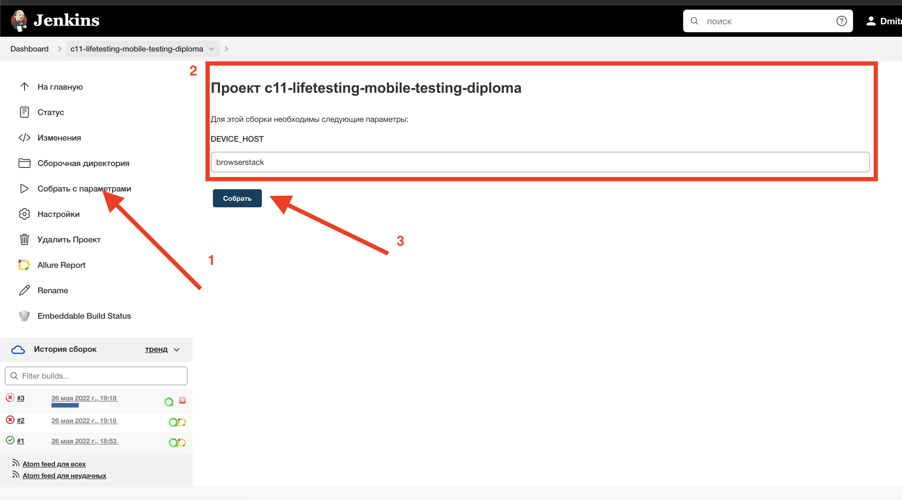

# UI automation project for mobile application Wikipedia
<p align="center"></p><a href="https://github.com/wikimedia/apps-android-wikipedia/releases/tag/latest"></a>

## :bulb: Content:

- [Technology stack](#gear-Technology-stack)
- [Implemented manual checks](#hand-Implemented-manual-checks)
- [Tests launch from Jenkins](#-Tests-launch-from-Jenkins#)
- [Tests launch from Terminal](#Tests-launch-from-Terminal)
- [Example of test execution](#-Example-of-test-execution)
- <a href="#point_up_2-видео-пример-прохождения-теста">Видео пример прохождения теста</a>

## :gear: Technology stack
<p align="center">
<a href="https://www.jetbrains.com/idea/"></a>
<a href="https://www.java.com/"></a>
<a href="https://github.com/"></a>
<a href="https://junit.org/junit5/"></a>
<a href="https://gradle.org/"></a>
<a href="https://selenide.org/"></a>
<a href="https://aerokube.com/selenoid/"></a>
<a href="https://github.com/allure-framework/allure2"></a>
<a href="https://qameta.io/"></a>
<a href="https://www.jenkins.io/"></a>
<a href="https://telegram.org/?setln=en/"></a>
<a href="https://www.browserstack.com/app-live/"></a>
<a href="https://appium.io/"></a>
</p>


## :point_up_2: Проведенный автотест
- Проверка стартовых экранов и поиска в приложении

## :white_check_mark: Implemented automated checks
- [x] Search test
- [x] Validation of design of introduction 1st page
- [x] Validation of design of introduction 2nd page
- [x] Validation of design of introduction 3rd page
- [x] Validation of design of introduction 4th page

##  Tests launch from [Jenkins](https://jenkins.autotests.cloud/job/c11-lifetesting-mobile-testing-diploma/)

*For launch remote tests it's necessary to click the option <code><strong>*Собрать с параметрами*</strong></code>, then to fill build settings and to click the button <code><strong>*Собрать*</strong></code>.*
<p align="center">
  
</p>

*After tests execution, in the panel <code><strong>*История сборок*</strong></code> in the row with build number
icons <code><strong>*Allure Report*</strong></code>
and <code><strong>*Allure TestOps*</strong></code> will appear.*

*Icon <code><strong>*Allure Report*</strong></code> opens
html-report in Allure Report.*

*Icon <code><strong>*Allure TestOps*</strong></code> opens
html-report in Allure TestOps.*

<p align="center">
  
</p>

##  Tests launch from Terminal

```
gradle clean test -DdeviceHost=browserstack / emulation / real 
```

##  [Allure TestOps](https://allure.autotests.cloud/launch/13139) report
### :pushpin: Overview dashboard

<p align="center">
  
</p>

### :pushpin: Test cases

<p align="center">
  
</p>

### :pushpin: Test launch from Allure TestOPS -> [Test Plan](https://allure.autotests.cloud/testplan/316/)

<p align="center">
  
</p>


## :point_up_2: Example of test execution

> A video is attached to each test in the report.


https://user-images.githubusercontent.com/84909251/170564995-992b9b10-2493-4b67-9eb1-52c0ca4a2c84.mp4


